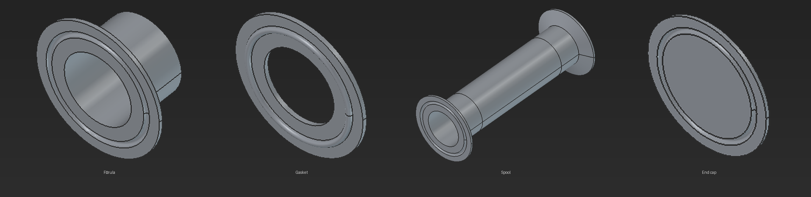
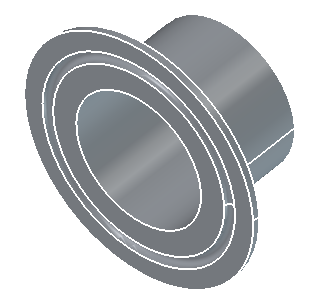
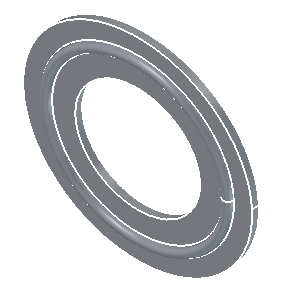
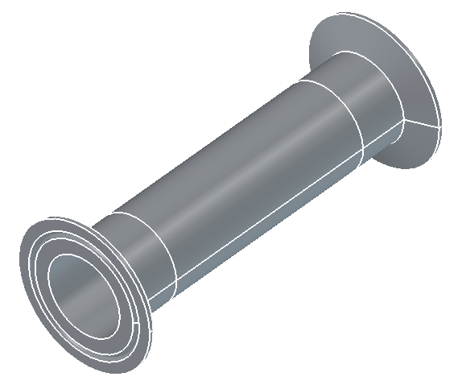
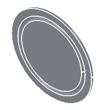

<p align="center">
  
</p>

# Tripta Clamps 3D — Workbench para FreeCAD

Workbench de FreeCAD para modelar **piezas tri-clamp** — ferulas, gaskets, spools y end caps — con dimensiones según **ASME BPE**. Elegís el tamaño, ajustás los parámetros y FreeCAD te genera el sólido, listo para recomputar y exportar.

Es la misma geometría que ya hicimos como [visitor 3D en la web](https://github.com/triptamina-labs/TriptaClamps3D-Web): en el navegador la ves girar y la descargás; acá queda adentro de FreeCAD como un workbench, para modelarla con el resto de tu pieza sin salir de la herramienta.

La parte de cálculo (perfiles, dimensiones, presets) es Python puro con tests; la capa de FreeCAD la envuelve como sólidos de revolución paramétricos.

---

## Piezas incluidas

| Pieza | Render | Descripción |
|-------|--------|-------------|
| **Férula** (ferrule) |  | Collar tri-clamp soldado al tubo; cara plana con bead para el sello. |
| **Gasket** |  | Junta tórica entre dos férulas; espesor y diámetro del preset. |
| **Spool** |  | Sección de tubo con férula en cada extremo (largo paramétrico). |
| **End cap** |  | Tapa ciega tri-clamp para sellar el extremo de una línea. |

Los renders se generan con material metálico (modo *Shaded*, sin aristas de construcción). Reproducibles con `scripts/render_media.py`.

---

## Características

- **4 piezas paramétricas** — férula, gasket, spool y endcap, sólidos de revolución válidos.
- **10 presets ASME BPE** — desde ½″ Mini hasta 4″ TC119, con dimensiones de férula, tubo y gasket certificadas.
- **Paramétrico en vivo** — cambia una dimensión y el sólido se reconstruye por recompute (`Ctrl+Shift+R`).
- **Panel de control acoplable** — `TriptaClamps3DOpenPanel` abre un dock `QDockWidget` nativo (View → Panels).
- **Comando de creación** — `TriptaClamps3DCreatePiece` genera la pieza directamente en la escena.
- **Constraint checking** — valida y acota dimensiones incompatibles con los límites ASME BPE.
- **Núcleo sin dependencia de FreeCAD** — la suite corre con pytest puro; FreeCAD solo se toca en la capa adaptadora.
- **Headless friendly** — imports GUI protegidos a nivel de módulo; se testea con `freecadcmd`.

---

## Instalación

### Modo 1 — Addon manager

1. Abre FreeCAD → *Tools → Addon Manager* → *Configure → Add to a custom repository* con la URL del repo, o instala desde el repositorio.
2. Reinicia FreeCAD.
3. Selecciona el workbench **Tripta Clamps 3D** en el selector de workbenches.

### Modo 2 — Manual (Linux / Flatpak)

```bash
MODDIR="$HOME/.var/app/org.freecad.FreeCAD/data/FreeCAD/v1-1/Mod"
mkdir -p "$MODDIR"
# symlink para desarrollo en vivo (recomendado)
ln -s ~/repos/tripta-clamps-3d-freecad "$MODDIR/TriptaClamps3D"
# o copia completa para uso estable
# cp -r ~/repos/tripta-clamps-3d-freecad "$MODDIR/TriptaClamps3D"
```

> Ruta del addon real (varía según instalación): confirma con
> `flatpak run --command=freecadcmd org.freecad.FreeCAD -c "import FreeCAD as A; print(A.ConfigGet('UserAppData'))"`

Reinicia FreeCAD. El workbench aparecerá como **Tripta Clamps 3D**.

---

## Uso

1. Abre FreeCAD y selecciona el workbench **Tripta Clamps 3D**.
2. Ejecuta *Tripta Clamps 3D → Open Panel* (`TriptaClamps3DOpenPanel`) para abrir el panel de control.
3. En el panel: elige **tipo de pieza** (férula / gasket / spool / endcap) y un **preset ASME BPE** (p. ej. `1.5″ · TC64`) o ajusta parámetros manualmente.
4. Pulsa **Create** (o usa *Tripta Clamps 3D → Create Piece*, `TriptaClamps3DCreatePiece`) para generar el sólido.
5. Modifica cualquier dimensión en la vista de propiedades y pulsa **Recompute** para actualizar el modelo.

---

## Manual de referencia — núcleo puro

El paquete `tripta_clamps_3d` está divido en una capa **pura** (testeable sin FreeCAD) y una **adaptadora**:

```text
tripta_clamps_3d/
├── profile_cmds.py     # Puro: MoveTo/LineTo/Arc + perfiles de férula/gasket/spool/endcap
├── constraints.py      # Puro: validate_and_clamp_dimensions
├── presets.py          # Puro: 10 presets ASME BPE + lookups por nombre/índice
├── geometry.py         # Adaptador: ProfileCmd → Line|ArcSegment (conversión de arcos)
├── builder.py          # Adaptador: wire→face→revolve 360° eje Y → Part.Solid
├── feature.py          # Adaptador: TriptaClamps3DFeature (Part::FeaturePython) + ViewProvider
├── commands.py         # Adaptador: TriptaClamps3DCreatePiece, TriptaClamps3DOpenPanel, register_commands()
├── panel.py            # Adaptador: panel QDockWidget + preset_to_props_map() (pura)
└── workbench.py        # Adaptador: TriptaClamps3DWorkbench
```

### Pipeline de generación

```
perfil (2D, puro)  →  geometry (arcos→segmentos)  →  builder (wire→face→revolve)  →  Part.Solid
```

`builder.build_solid(tipo, params)` usa `Part.Face(wire).revolve(...)` — no `wire.revolve()`, que produce una `Part.Shell` (superficie) en lugar de un sólido.

---

## Tests

### Suite del núcleo (pytest, sin FreeCAD)

```bash
python -m pytest tests/ -v
# → 88 passed
```

### Smoke test de integración (FreeCAD headless)

```bash
flatpak run --env=PYTHONPATH=$PWD --command=freecadcmd org.freecad.FreeCAD \
  -c "import tripta_clamps_3d; print('IMPORT_OK')"
```

Genera los 4 sólidos válidos (volumen > 0, `Shape.isValid`, bbox no degenerado):

```bash
flatpak run --env=PYTHONPATH=$PWD --command=freecadcmd org.freecad.FreeCAD \
  -c "exec(open('tests/smoke_feature_cmd.py').read())"
```

### Regenerar los renders del README

```bash
./scripts/render_media.py    # necesita FreeCAD (flatpak), Xvfb y PIL
```

---

## Estado del proyecto

| Área | Estado |
|------|--------|
| Núcleo puro (perfiles, constraints, presets) | ✅ Completado · 88 tests |
| Capa FreeCAD (feature paramétrica, builder) | ✅ Completado · smoke 4/4 sólidos |
| Panel de control + comandos del workbench | ✅ Completado |
| Rendering para documentación | ✅ Completado (`docs/media/`) |
| Verificación visual en GUI | ✅ Completado |

---

## Roadmap

- [x] Paquete Python puro con datos ASME BPE
- [x] Restricciones dimensionales y validación
- [x] Comandos de creación de perfiles
- [x] Feature `Part::FeaturePython` paramétrica
- [x] Panel de control interactivo
- [ ] Exportación asistida a STEP/BREP
- [ ] Integración con Assembly / contenedores
- [ ] Iconos personalizados del workbench
- [ ] Más tamaños/estándares (DIN/ISO)

---

## Licencia

MIT — ver [LICENSE](LICENSE).

---

**Autor:** Felipe Castellanos Cárdenas — [TriptaLabs](https://triptalabs.co)
